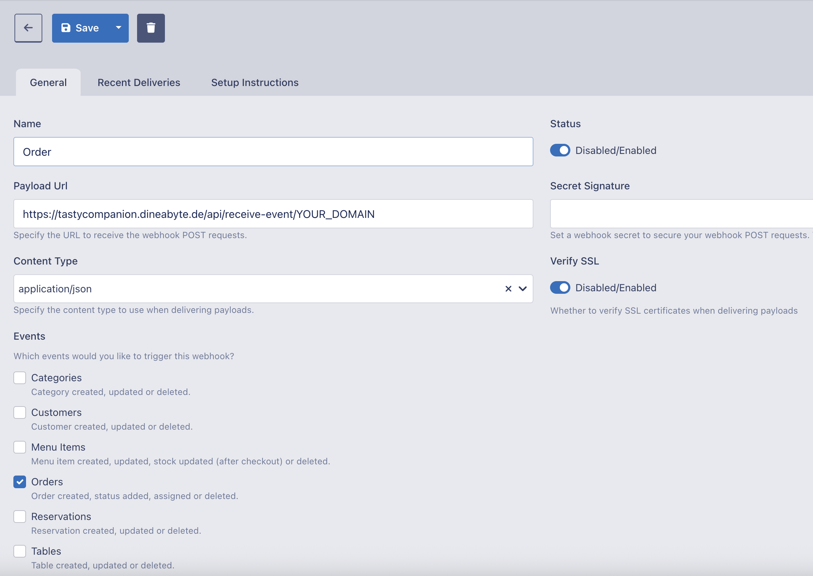

# Webhook Configuration

Follow these steps to configure your TastyIgniter webhook so that TaCo (TastyIgniter Companion) receives real-time **order** updates.

---

## 1. Open Webhooks in TastyIgniter Admin

1. Log in to your TastyIgniter back-end.  
2. Go to **System → Settings → Webhooks**.  
3. Click **Create New** (or edit an existing webhook).

---

## 2. Basic Settings

- **Name**: `Order`  
  _(This helps you identify the webhook — it can be anything, but “Order” is clear.)_

- **Payload URL**:  
Important: Replace the following URL with your TastyIgniter domain:
https://tastycompanion.dineabyte.de/api/receive-event/YOUR_DOMAIN \
For example: If you access your TastyIgniter domain with restaurant.com it would look like this:
https://tastycompanion.dineabyte.de/api/receive-event/restaurant.com




---

## 3. Optional Query Parameters

You can modify the webhook notification behavior by adding the following query parameters to your Payload URL:

- **retry**: Number of times to retry sending the status change webhook if it is not acknowledged (maximum 3 retries).
  _Useful for customers who may not check their devices frequently._
- **interval**: Time in seconds between each retry attempt (maximum 600 seconds).

### Example Usage

Suppose you want the notification to be sent up to 3 times, waiting 60 seconds between each attempt:

```
https://tastycompanion.dineabyte.de/api/receive-event/restaurant.com?retry=3&interval=60
```
